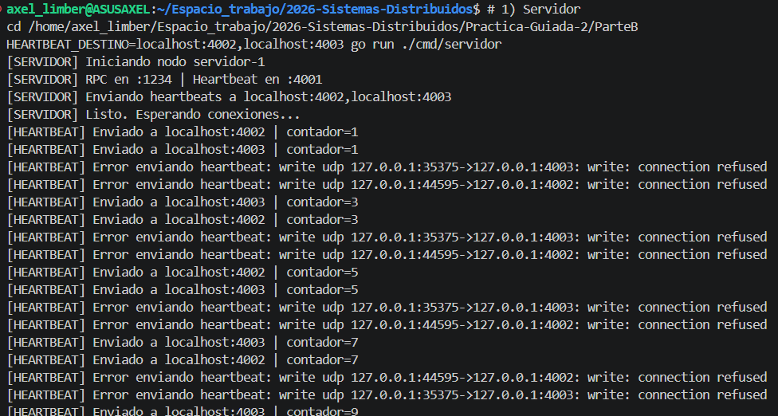
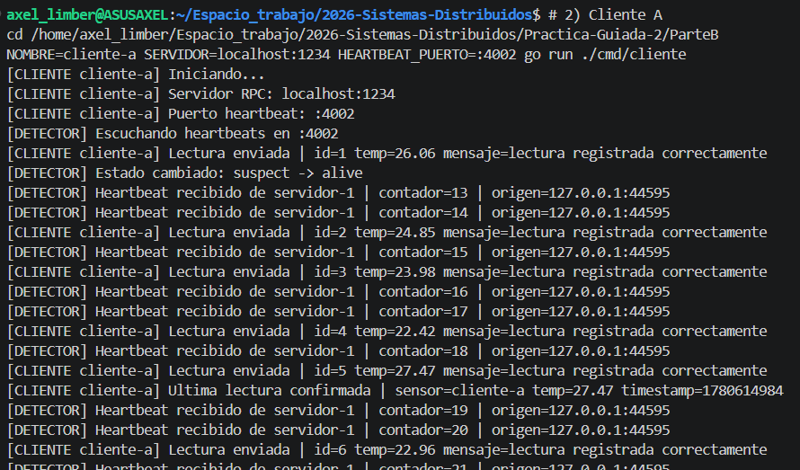
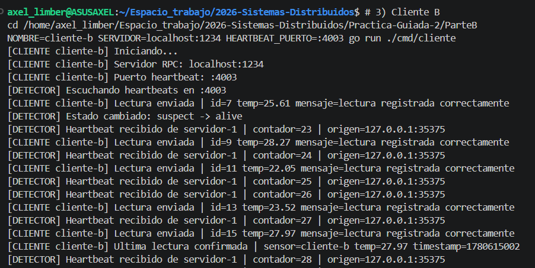

# Servicio de Telemetria con Deteccion de Fallos


Proyecto base para la parte B de la Practica Guiada 2: RPC, reintentos y deteccion de fallos.

## Integrantes

- Limberger, Axel Agustín
- Ernst, Milagros Shaiel
- Verón, Juan Manuel

## Ejecucion

### Local

```bash
# Terminal 1: Servidor
make run-servidor

# Terminal 2: Cliente
NOMBRE=cliente-a SERVIDOR=localhost:1234 make run-cliente

# Terminal 3: Segundo cliente
NOMBRE=cliente-b SERVIDOR=localhost:1234 make run-cliente
```

### Docker Compose (interactivo)

**1. Levantar solo el servidor** (en background):
```bash
make docker-up
```

**2. Conectar clientes** (en terminales separadas):
```bash
# Terminal 2: Cliente 1
make docker-cliente1

# Terminal 3: Cliente 2
make docker-cliente2
```

**3. Ver logs del servidor**:
```bash
make docker-logs
```

**4. Detener todo**:
```bash
make docker-down
```

## Requisitos completados

- [x] Servidor RPC con metodos `RegistrarLectura` y `ObtenerUltimaLectura`
- [x] Protocolo JSON en todos los mensajes (structs con tags json)
- [x] Cliente RPC con loop automatico de lecturas
- [x] Heartbeat UDP: servidor envia, cliente detecta timeout con estados `alive/suspect/dead`
- [x] Docker Compose con al menos 1 servidor + 2 clientes

## Captura de ejecucion

### **Captura 1**: servidor iniciado, RPC escuchando y heartbeats enviados.



### **Captura 2**: cliente A iniciado, heartbeats recibidos y lecturas RPC enviadas.



### **Captura 3**: cliente B iniciado, heartbeats recibidos y lecturas RPC enviadas.


